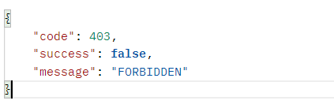
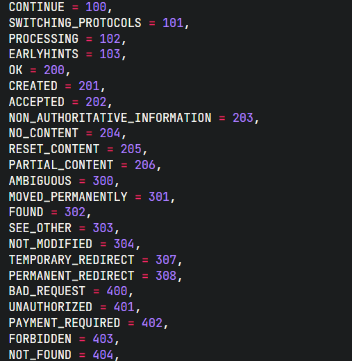

## koa-ts-template

这是一个通用的 koa typescript 配置环境，支持的功能如下

- 集成 [prisma](https://www.prisma.io/) 对 ts 类型支持友好的数据库 ORM 支持 MYSQL/PostgreSQL/SQLite/MongoDB 等 集成在分支 prisma 上如需使用请切换
- 封装了数据返回规范和错误处理函数

  

  

```ts
//  错误处理
ctx.onError({
  code: HttpStatus.FORBIDDEN,
});
//  成功数据返回
ctx.onSuccess({
  data: res,
  code: HttpStatus.OK,
});
```

- 封装通用的路由中间件注册方案解放双手不用手动注册路由

- 如果想使用较为全面的模板 可以使用 general 分支，该分支集成了常见的用户注册和 jwt 用户登录的方式

## 使用

- 安装依赖

```
npm install

```

- 启动

```
npm run start
```
